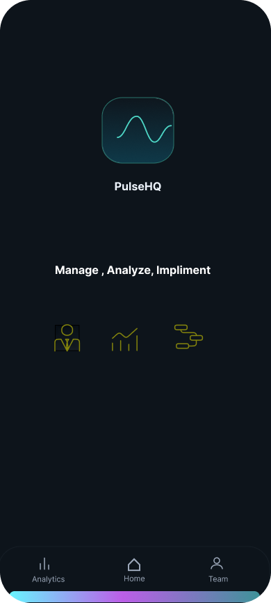
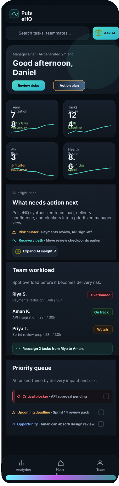
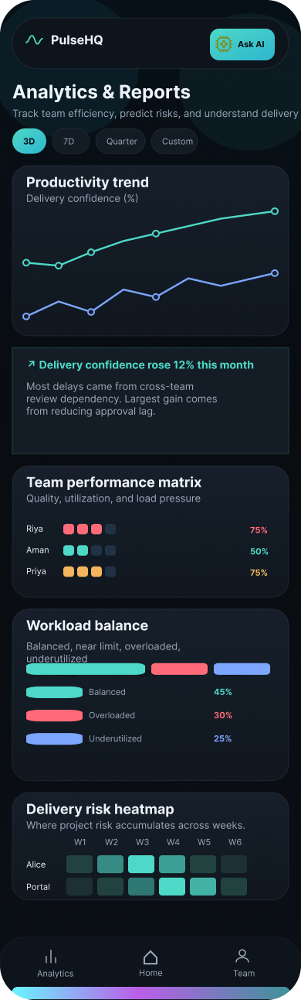

# PulseHQ - AI-Powered Team Management App

[](https://github.com/Kaustobh/Pulse-HQ/actions/workflows/deploy.yml)
[](https://opensource.org/licenses/MIT)
[](https://nodejs.org/)
[](https://vitejs.dev/)

🚀 **Live Demo**: [https://Kaustobh.github.io/Pulse-HQ/](https://Kaustobh.github.io/Pulse-HQ/)

**PulseHQ** is an AI-synthesized team management platform built to help engineering managers monitor real-time utilization, predict delivery risks, balance sprint workloads, and analyze team productivity trends through intuitive dark glassmorphic dashboards.

### 📸 Visual Previews

| Splash Screen | Home Dashboard | Analytics & Reports |
| :---: | :---: | :---: |
|  |  |  |

---

## 🌟 Key Features & Highlights

- **Manager Brief & Risk Alerts**: Real-time AI status summary, action plan modal, and risk cluster indicators.
- **4 Live Metric Cards**: Team Utilization (78%), Tasks Today (12/18 baseline), At-Risk items (3), and Health Score (8.6) with interactive SVG sparklines.
- **Interactive Workload Rebalancing Engine**: One-click task rebalancing transferring logged hours from overloaded team members (e.g. Riya S. -> Aman K.) with instant animated metric updates.
- **Priority Queue Checklist**: Interactive task queue with risk tag indicators (`Critical blocker`, `Upcoming deadline`, `Opportunity`) and dynamic task creation.
- **Analytics & Reports View (Cyan Neon Aesthetic)**: Timeframe filter chips (`3D`, `7D`, `Quarter`), SVG interactive productivity trend line chart with hover tooltips, team performance matrix, workload distribution stacked bar, and delivery risk heatmap matrix.
- **Team & Meeting Hub View (Purple Neon Aesthetic)**: Hero preview with interactive modules (`Wire-frames`, `Assumptions`, `Icon`), team member directory, and 1:1 meeting scheduler.
- **Ask AI Drawer Assistant**: Real-time AI assistant drawer for query handling and actionable task insights.
- **Dual View Modes**: Seamless switcher between **Phone Frame View** (390px native mobile preview) and **Responsive Desktop Mode**.
- **Standardized Copyright Notice**: Subdued, secondary copyright notice (`Copyright © 2026 Kaustobh Bhattacharya`) isolated across all footers.

---

## 🛠️ Technology Stack

- **Frontend**: React 19, Vite, Framer Motion, Lucide Icons, Plus Jakarta Sans
- **Styling**: Vanilla CSS with HSL/HEX design tokens, dark glassmorphism (`#0A0E17`), Cyan Neon (`#00F2FE`), and Purple Neon (`#D946EF`)
- **Backend API**: Node.js & Express REST server
- **Dev Tools & Deployment**: Concurrently, GitHub Actions, GitHub Pages

---

## 💻 Local Development & Quickstart

### Prerequisites
- [Node.js](https://nodejs.org/) `>= 20.0.0`
- `npm` `>= 10.0.0`

### Installation & Setup

1. **Clone the Repository**:
   ```bash
   git clone https://github.com/Kaustobh/Pulse-HQ.git
   cd Pulse-HQ
   ```

2. **Install Dependencies**:
   ```bash
   npm install
   ```

3. **Start Fullstack Development Environment**:
   ```bash
   npm run dev
   ```
   - **Frontend App**: `http://localhost:5173/Pulse-HQ/`
   - **Backend Server**: `http://localhost:3001`

4. **Build for Production**:
   ```bash
   npm run build
   ```

---

## 📁 Project Directory Structure

```
Pulse-HQ/
├── .github/
│   └── workflows/
│       └── deploy.yml          # GitHub Actions deployment pipeline
├── public/
│   ├── .nojekyll               # Prevents GitHub Pages Jekyll asset ignoring
│   ├── 404.html                # Single Page App routing fallback
│   ├── favicon.svg
│   └── icons.svg
├── server/
│   └── index.js                # Express REST API server & state engine
├── src/
│   ├── components/
│   │   ├── ActionPlanModal.jsx # Manager brief action plan drawer
│   │   ├── AIAssistantModal.jsx# Interactive Ask AI assistant drawer
│   │   ├── AnalyticsView.jsx   # Analytics & Reports screen (Cyan Neon)
│   │   ├── DashboardView.jsx   # Home Manager Dashboard screen
│   │   ├── MeetingView.jsx     # Team & Meeting Hub screen (Purple Neon)
│   │   └── SplashLoader.jsx    # Splash loading screen
│   ├── App.jsx                 # Core routing, view switcher, and header
│   ├── main.jsx                # React root entry point
│   └── index.css               # Design system & dark glassmorphic styles
├── CHANGELOG.md                # Version release history
├── CONTRIBUTING.md             # Developer contribution guidelines
├── DEPLOYMENT.md               # CI/CD and hosting documentation
├── package.json
├── README.md
└── vite.config.js              # Vite bundler configuration (base: '/Pulse-HQ/')
```

---

## 🚢 Deployment Summary

PulseHQ is configured for automated CI/CD deployment to **GitHub Pages** via **GitHub Actions**.

- **Workflow File**: `.github/workflows/deploy.yml`
- **Output Directory**: `dist/`
- **Live Base URL**: `https://Kaustobh.github.io/Pulse-HQ/`

For detailed hosting and troubleshooting instructions, see [`DEPLOYMENT.md`](./DEPLOYMENT.md).

---

## 📜 License & Copyright

Copyright © 2026 Kaustobh Bhattacharya. All rights reserved.  
Licensed under the [MIT License](./LICENSE).
